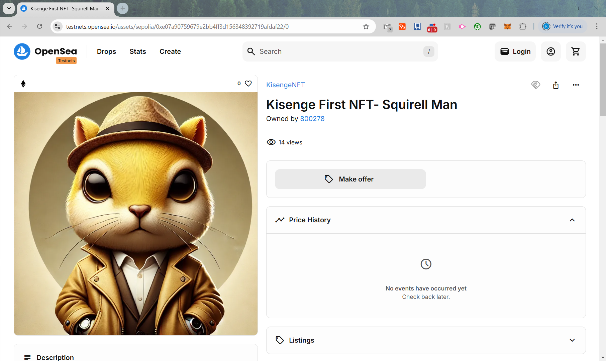
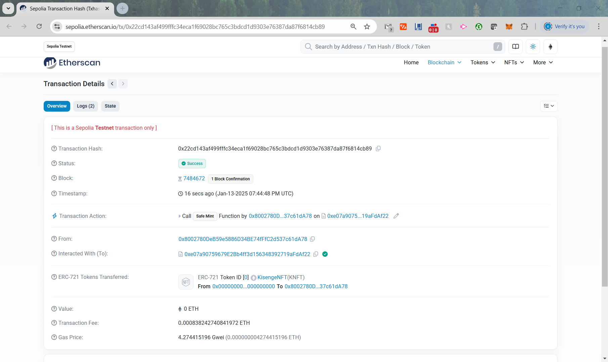

# Kisenge NFT Project

[Link to OpenSea](https://testnets.opensea.io/assets/sepolia/0xe07a90759679e2bb4ff3d156348392719afdaf22/0)

[Link to EtherScan](https://sepolia.etherscan.io/tx/0x22cd143af499fffc34eca1f69028bc765c3bdcd1d9303e76387da87f6814cb89)

## Purpose

The purpose of this project was to learn more about crypto technologies- more specifically about writing and deploying basic smart contracts. I am very new to the space and this is my first crypto based project. I primarily followed the Alchemy tutorial at 
[Alchemy NFT Tutorial](https://docs.alchemy.com/docs/how-to-develop-an-nft-smart-contract-erc721-with-alchemy)

## Technology/Stack Used

- The contract was written in the Solidity language.
- The contract was written using the Remix IDE
- I used Alchemy as an interface to interact with the blockchain network
- I developed on the Ethereum Sepolia network, since it is inexpensive compared to mainnet alternatives.
